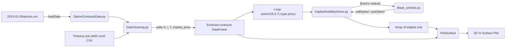

# Options Implied Volatility Surface Framework

A lightweight Python pipeline that takes a raw options-chain snapshot, backs out each contract's **Black-Scholes implied volatility**, and renders the results as a **3D implied volatility surface** (strike × time-to-expiry × IV).

Built as an educational/quant-finance project exploring the full path from raw market data to a volatility surface: data ingestion → cleaning & enrichment (spot price, risk-free rate, time-to-expiry) → root-finding for implied vol → 3D visualization.


## Overview

Given a snapshot of listed option contracts (strikes, expirations, bid/ask quotes), this framework:

1. Loads the raw options chain.
2. Cleans and enriches it — filters bad quotes, computes a mid-market price, time-to-expiration, an interpolated risk-free rate from the US Treasury par-yield curve, and the underlying's historical spot price.
3. Inverts the Black-Scholes formula (via Brent's root-finding method) for every contract to recover its implied volatility.
4. Plots the resulting cloud of implied volatilities as a 3D surface over strike and time-to-expiration.

The included sample dataset (`2013-02-26options.csv`) is a snapshot of option quotes dated **26 February 2013**.

## Key Features

- **Analytical Black-Scholes pricer** for European calls and puts.
- **Implied volatility solver** using `scipy.optimize.brentq` to invert market price → IV, bounded to a search window of `[0.00001, 5.0]` (i.e. 0.001%–500% annualized vol).
- **Automated data enrichment**:
  - Mid-price from bid/ask.
  - Time-to-expiration (`T`) in years from quote date and expiration date.
  - Risk-free rate (`r`) linearly interpolated from the daily US Treasury par-yield curve (1 Mo → 30 Yr tenors).
  - Spot price (`S`) pulled per-contract via `yfinance`.
- **3D surface visualization** (`matplotlib` `plot_trisurf`) of implied volatility against strike price and time-to-expiration.

## Pipeline / How It Works



`main.py` is the orchestrator that wires every module above together end to end.

## Repository Structure

| File | Purpose |
|---|---|
| `main.py` | Entry point. Loads data, cleans it, loops over every contract solving for implied volatility, and plots the resulting surface. |
| `OptionContractsData.py` | `loadData(option_contracts)` — reads the raw options CSV into a `pandas.DataFrame`. |
| `DataCleaning.py` | `cleanData(options, usTreasury)` — filters valid quotes, computes mid-price, `T`, interpolated risk-free rate `r` from the Treasury curve, and spot price `S` via `yfinance`. |
| `Black_scholes.py` | `callOption(S,K,T,r,sigma)` / `putOption(S,K,T,r,sigma)` — closed-form Black-Scholes pricers. |
| `ImpliedVolatilitySolver.py` | `solveIV(S,K,T,r,option_type,market_price)` — root-finds implied volatility with `scipy.optimize.brentq`. |
| `PlotSurface` | `surface(iv, filtered_options)` — renders the 3D `matplotlib` trisurf plot. *(Note: currently has no `.py` extension — see [Known Issues](#known-issues--current-limitations).)* |
| `2013-02-26options.csv` | Sample options-chain snapshot used as default input. |
| `.gitignore` | Present but currently empty. |

## Mathematical Background

**Black-Scholes price** (no dividends), with $d_1$ and $d_2$ defined as:

$$
d_1 = \frac{\ln(S/K) + (r + \tfrac{1}{2}\sigma^2)T}{\sigma\sqrt{T}}, \qquad d_2 = d_1 - \sigma\sqrt{T}
$$

Call and put prices:

$$
C = S\,\Phi(d_1) - K e^{-rT}\Phi(d_2), \qquad P = K e^{-rT}\Phi(-d_2) - S\,\Phi(-d_1)
$$

where $\Phi(\cdot)$ is the standard normal CDF.

**Implied volatility** is the value of $\sigma$ that makes the model price equal the observed market price:

$$
\sigma_{\text{IV}} = \sigma \quad \text{such that} \quad C(S,K,T,r,\sigma) - C_{\text{market}} = 0
$$

Since this equation has no closed-form inverse, the framework solves it numerically with **Brent's method**, a derivative-free bracketing root-finder that combines bisection, secant, and inverse quadratic interpolation.

## Data Requirements

### 1. Options chain CSV (included)

`2013-02-26options.csv` is used by default. Based on the columns referenced in the code, an input file needs (at minimum):

- `underlying` — ticker symbol
- `quote_date`, `expiration` — used to compute `T`
- `strike` — strike price
- `bid`, `ask` — used to compute the mid market price
- an option-type column (`call`/`put`)

### 2. US Treasury par-yield curve CSV (**not included — must be sourced separately**)

`main.py` references `par-yield-curve-rates-2010-2019.csv`, which is **not present in the repository**. Download it from the [U.S. Department of the Treasury's Daily Treasury Par Yield Curve Rates](https://home.treasury.gov/resource-center/data-chart-center/interest-rates/TextView?type=daily_treasury_yield_curve) page as CSV. It must contain a `Date` column plus the tenor columns the code expects:

```
1 Mo, 2 Mo, 3 Mo, 6 Mo, 1 Yr, 2 Yr, 3 Yr, 5 Yr, 7 Yr, 10 Yr, 20 Yr, 30 Yr
```

Place the downloaded file in the project root (or update the path in `main.py`).

## Installation

```bash
git clone https://github.com/aabhasp6UCL/Options-Implied-Volatility-Surface-Framwork.git
cd Options-Implied-Volatility-Surface-Framwork

python -m venv venv
source venv/bin/activate      # Windows: venv\Scripts\activate

pip install numpy pandas scipy matplotlib yfinance
```

> The repository does not currently ship a `requirements.txt`. Consider adding one (see [Future Development Ideas](#future-development-ideas)) with pinned versions of the packages above.

## Usage

Once the options CSV and Treasury par-yield CSV are both in place:

```bash
python main.py
```

This will:
1. Load and clean the option contracts.
2. Solve for implied volatility contract-by-contract.
3. Open a `matplotlib` window with the 3D implied volatility surface.

## Configuration

Currently, run parameters are hardcoded at the top of `main.py`:

```python
option_contracts = "2013-02-26options.csv"
usTreasury = "par-yield-curve-rates-2010-2019.csv"
```
## Future Development Ideas

- Add a pinned `requirements.txt` / `pyproject.toml`, and auto-download/cache the Treasury par-yield curve instead of requiring a manual file.
- Batch/vectorize the `yfinance` spot-price lookups with local caching (SQLite/Parquet) instead of one network call per row.
- Replace/augment Brent's method with a Newton-Raphson solver using Black-Scholes vega, with arbitrage-violation checks so bad quotes fail gracefully instead of crashing the solver.
- Add American-option support (binomial tree or Barone-Adesi-Whaley) and a dividend yield `q` (Black-Scholes-Merton), since the current model assumes European exercise with no dividends.
- Fit a smooth, arbitrage-free surface (e.g., SVI or spline interpolation) rather than a raw triangulated scatter plot, plus 2D smile/term-structure cross-sections and a moneyness-based (`K/S`) axis option.
- Make the plot interactive (Plotly 3D or a Streamlit/Dash app) instead of a static `matplotlib` window.
- Package the project properly (`pyproject.toml`, CLI via `click`/`typer`, config file, logging/progress bars) instead of hardcoded scripts.
- Add automated tests (`pytest`), CI (GitHub Actions with lint + tests), type hints (`mypy`), and a `Dockerfile` for reproducibility.
- Compute option Greeks (delta, gamma, vega, theta, rho) and vol-trading metrics (e.g., risk reversal, butterfly) alongside IV.
- Persist and animate historical surfaces over time; support live/streaming data and other asset classes (FX, index, futures options).
- Add example notebooks, generated API docs (`mkdocs`/`Sphinx`), and a `CONTRIBUTING.md`.

## Contributing

Contributions are welcome:

1. Fork the repository.
2. Create a feature branch (`git checkout -b feature/your-feature`).
3. Commit your changes with clear messages.
4. Push and open a pull request describing what changed and why.

Please consider tackling one of the items in [Known Issues](#known-issues--current-limitations) first — several are quick, high-value fixes (the broken import and the undefined-variable bug in particular block the pipeline from running at all).

## License

No license file is currently present in this repository. Until one is added, all rights are reserved by default by the author. If you intend to share this project publicly, consider adding an [MIT License](https://choosealicense.com/licenses/mit/), which is common for academic and portfolio projects.

## Author

**aabhasp6UCL** — [github.com/aabhasp6UCL](https://github.com/aabhasp6UCL)
